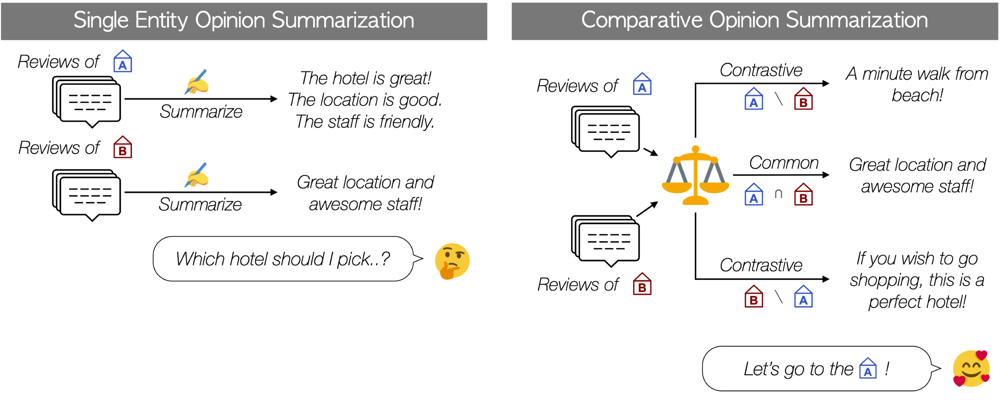
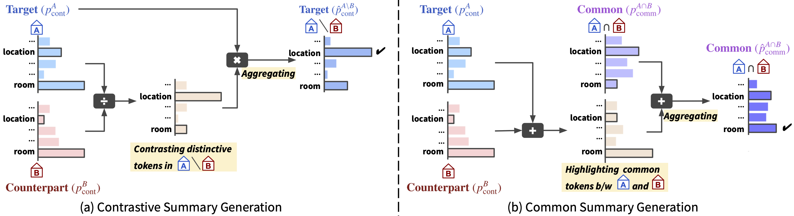

# Comparative Opinion Summarization via Collaborative Decoding

[](https://aclanthology.org/)
[](https://arxiv.org/abs/2110.07520/)

This repository contains the dataset, source code and trained
model [Comparative Opinion Summarization via Collaborative Decoding](https://arxiv.org/pdf/2110.07520/).



## Citations

```bibtex
@inproceedings{iso22aclfindings,
    title = {{C}omparative {O}pinion {S}ummarization via {C}ollaborative {D}ecoding},
    author = {Hayate Iso and
              Xiaolan Wang and
              Stefanos Angelidis and
              Yoshihiko Suhara},
    booktitle = {Findings of the Association for Computational Linguistics (ACL)},
    month = {May},
    year = {2022}
}
```

## Setup

Please use the command below to setup and install requirements.

```shell
conda create -n cocosum python=3.8
conda activate cocosum
pip install -r requirements.txt 
```

## CoCoTrip dataset

The script ``prep.py`` automatically downloads the public TripAdvisor dataset
by [Wang+(2010)](https://www.cs.virginia.edu/~hw5x/dataset.html), and builds the CoCoTrip dataset, which includes
self-supervised training and evaluation sets.

```shell
python prep.py ./data/
head -n 50000 ./data/train_cont_all.jsonl > ./data/train_cont_50k.jsonl 
head -n 1000 ./data/train_comm_pair.jsonl > ./data/train_comm_pair_1k.jsonl
```

## Available models

All models are hosted on huggingface 🤗 model hub (https://huggingface.co/megagonlabs/).

| Model name                                                                            | Task        | Training setting | 
|:--------------------------------------------------------------------------------------|:------------|:----------------:|
| [megagonlabs/cocosum-cont-self](https://huggingface.co/megagonlabs/cocosum-cont-self) | Contrastive | Self-supervision |
| [megagonlabs/cocosum-cont-few](https://huggingface.co/megagonlabs/cocosum-cont-few)   | Contrastive |     Few-shot     | 
| [megagonlabs/cocosum-comm-self](https://huggingface.co/megagonlabs/cocosum-comm-self) | Common      | Self-supervision | 
| [megagonlabs/cocosum-comm-few](https://huggingface.co/megagonlabs/cocosum-comm-few)   | Common      |     Few-shot     |

## Usage



You can generate contrastive and common opinion summaries by combining two base models, as referred to
Collaborative-decoding. After making the CoCoTrip dataset, you can just run the following to download our pre-trained
model from huggingface model hub and generate the summaries.

```shell
# Co-Decoding for Contrastive Opinion Summarization
python decode.py \
  ./data/ \
  cont \
  gen/cont/codec/ \  # directory to store generated summaries
  megagonlabs/cocosum-cont-few \  # Target model
  --counter_model_checkpoint megagonlabs/cocosum-cont-few \  # Counterpart model
  --alpha 0.5 \  # hyper-parameter
  --top_p 0.9

# Co-Decoding for Common Opinion Summarization  
python decode.py \
  ./data/ \
  comm \
  gen/comm/codec \
  megagonlabs/cocosum-comm-few \  # Target model
  --counter_model_checkpoint megagonlabs/cocosum-cont-few \  # Counterpart model. The contrastive summarization model is used in this case.
  --alpha 0.5 \  # hyper-parameter
  --top_p 0.9 \
  --do_ens_tgt \
  --do_ens_cnt \
  --ens_method add  # combining the output by summing up
```

# Reproduction

## Training

After building CoCoTrip dataset, you can train the base contrastive and common opinion summarization models by running
the following commands using self-supervised dataset!!

```shell
# Contrastive Summarization Model -- Self-supervision
python train.py \
  ./data/train_cont_50k.jsonl \
  --default_root_dir ./log/cont/self \
  --accumulate_grad_batches 8 \
  --gradient_clip_val 1.0 \
  --max_steps 50000 \
  --warmup 1000 \
  --val_check_interval 5000 \
  --task cont \
  --gpus 1
  
# Common Opinion Summarization -- Self-supervision
python train.py \
  ./data/train_comm_pair_1k.jsonl \
  --default_root_dir ./log/comm/self \
  --accumulate_grad_batches 8 \
  --gradient_clip_val 1.0 \
  --max_steps 5000 \
  --warmup 100 \
  --val_check_interval 500 \
  --task comm \
  --use_pair \
  --gpus 1
```

If you want to further train the model on top of self-supervised opinion summarization model, you can run the
followings:

```shell
# Contrastive Summarization Model -- Few-Shot
python train.py \
  ./data/few_cont.jsonl \
  --default_root_dir ./log/cont/few \
  --accumulate_grad_batches 8 \
  --gradient_clip_val 1.0 \
  --max_steps 1000 \
  --warmup 100 \
  --val_check_interval 100 \
  --task cont \
  --ckpt log/cont/self/lightning_logs/version_0/checkpoints/ \
  --gpus 1

# Common Opinion Summarization -- Few-Shot
python train.py \
 ./data/few_comm_pair.jsonl \
 --default_root_dir ./log/comm/few \
 --accumulate_grad_batches 8 \
 --gradient_clip_val 1.0 \
 --max_steps 1000 \
 --warmup 100 \
 --val_check_interval 100 \
 --task comm \
 --use_pair \
 --ckpt log/comm/self/lightning_logs/version_0/checkpoints/ \
 --gpus 1 
```

## Decoding

Once you train the models for both contrastive and common opinion summarizations, it's time to generate summaries using
Co-decoding!

```shell
# Co-Decoding for Contrastive Opinion Summarization
python decode.py \
  ./data/ \
  cont \
  gen/cont/codec/ \  # directory to store generated summaries
  log/cont/few/lightning_logs/version_0/checkpoints/ \  # Target model
  --counter_model_checkpoint log/cont/few/lightning_logs/version_0/checkpoints/ \  # Counterpart model
  --alpha 0.5 \  # hyper-parameter
  --top_p 0.9

# Co-Decoding for Common Opinion Summarization  
python decode.py \
  ./data/ \
  comm \
  gen/comm/codec \
  ./log/comm/few/lightning_logs/version_0/checkpoints/ \  # Target model
  --counter_model_checkpoint log/cont/few/lightning_logs/version_0/checkpoints/ \  # Counterpart model. The contrastive summarization model is used in this case.
  --alpha 0.5 \  # hyper-parameter
  --top_p 0.9 \
  --do_ens_tgt \
  --do_ens_cnt \
  --ens_method add  # combining the output by summing up
```

# Evaluation

Finally, you can evaluate your generated summaries with all the evaluation metrics by running the following command!

```shell
python evaluate.py \ 
  ./data/ \
  ./gen/cont/codec/outputs.json \  # path of the generated contrastive summaries
  ./gen/comm/codec/outputs.json  # path of the generated common summaries
```

# Acknowledgement

The repository is build based on the [naacl2021-longdoc-tutorial](https://github.com/allenai/naacl2021-longdoc-tutorial)
.

# Disclosure

Embedded in, or bundled with, this product are open source software (OSS) components, datasets and other third party
components identified below. The license terms respectively governing the datasets and third-party components continue
to govern those portions, and you agree to those license terms, which, when applicable, specifically limit any
distribution. You may receive a copy of, distribute and/or modify any open source code for the OSS component under the
terms of their respective licenses. In the event of conflicts between Megagon Labs, Inc. Recruit Co., Ltd., license
conditions and the Open Source Software license conditions, the Open Source Software conditions shall prevail with
respect to the Open Source Software portions of the software. You agree not to, and are not permitted to, distribute
actual datasets used with the OSS components listed below. You agree and are limited to distribute only links to
datasets from known sources by listing them in the datasets overview table below. You are permitted to distribute
derived datasets of data sets from known sources by including links to original dataset source in the datasets overview
table below. You agree that any right to modify datasets originating from parties other than Megagon Labs, Inc. are
governed by the respective third party’s license conditions. All OSS components and datasets are distributed WITHOUT ANY
WARRANTY, without even implied warranty such as for MERCHANTABILITY or FITNESS FOR A PARTICULAR PURPOSE, and without any
liability to or claim against any Megagon Labs, Inc. entity other than as explicitly documented in this README document.
You agree to cease using any part of the provided materials if you do not agree with the terms or the lack of any
warranty herein. While Megagon Labs, Inc., makes commercially reasonable efforts to ensure that citations in this
document are complete and accurate, errors may occur. If you see any error or omission, please help us improve this
document by sending information to contact_oss@megagon.ai.

All dataset and code used within the product are listed below (including their copyright holders and the license conditions).
For Datasets having different portions released under different licenses, please refer to the included source link
specified for each of the respective datasets for identifications of dataset files released under the identified
licenses.


| ID  | OSS Component Name               | Modified | Copyright Holder | Upstream Link                                                                                             | License            | 
|-----|----------------------------------|----------|------------------|-----------------------------------------------------------------------------------------------------------|--------------------|
| 1   | Longformer encoder-decoder model | Yes      | Hugging Face     | [link](https://github.com/huggingface/transformers/blob/main/src/transformers/models/led/modeling_led.py) | Apache License 2.0 |


| ID  | Dataset             | Modified | Copyright Holder       | Source Link                                              | License | 
|-----|---------------------|----------|------------------------|----------------------------------------------------------|---------|
| 1   | TripAdvisor dataset | Yes      | University of Virginia | [source](https://www.cs.virginia.edu/~hw5x/dataset.html) |         |
